  

## About me

I'm an ML and software engineer in London with an MSc in Computer Science (Machine Learning) from Queen Mary University of London. I like building LLM systems end to end: the retrieval, the agent orchestration, the evaluation, and the APIs and infrastructure that put them in front of users.

**What I like working on**

- **Multi-agent LLM systems.** Breaking a task into specialised agents and getting them to coordinate reliably. I'm currently building a LangGraph pull request reviewer where security, performance, and style agents feed a synthesiser that writes one structured review.
- **RAG systems.** Especially the question of *which* part of the pipeline actually drives quality. My MSc thesis, SoundRAG, found that LLM re-ranking mattered far more than the choice of retriever.
- **Recommendation systems.** Particularly the cold-start problem: recommending well when there's little or no user history to learn from.
- **Taking ML to production.** At Intellicon I cut latency by 60% on a FastAPI and Kubernetes banking platform, and I enjoy that side as much as the modelling.

**Currently**

- Building the multi-agent PR reviewer and adding an evaluation harness against human reviews
- Open to graduate software engineering, AI/ML, and forward deployed engineering roles in London

## Tech stack

**Languages**

**LLM and RAG**

**Machine learning**

**Backend and frontend**

**Databases**

**Cloud and DevOps**

